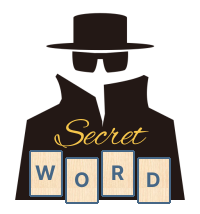

<h1 align="center"> Secret Word </h1>

Jogo desenvolvido a partir do curso <a href="https://www.udemy.com/course/react-do-zero-a-maestria-c-hooks-router-api-projetos/"> React do Zero a Maestria (c/ hooks, router, API, Projetos) </a> lecionado por Matheus Battisti e publicado na plataforma Udemy.

  <a href="#-tecnologias">Tecnologias</a>&nbsp;&nbsp;&nbsp;|&nbsp;&nbsp;&nbsp;
  <a href="#-projeto">Projeto</a>

 

  

## 🚀 Tecnologias utilizadas

Esse projeto foi desenvolvido com as seguintes tecnologias:

- HTML
- CSS
- JavaScript

## 💻 O Projeto

Este projeto foi feito com a ajuda do curso <a href="https://www.udemy.com/course/react-do-zero-a-maestria-c-hooks-router-api-projetos/"> React do Zero a Maestria </a>, funcionando como um jogo onde precisamos adivinhar letras de palavras ocultas.  
Atualmente o jogo possui 30 palavras divididas em 6 categorias: países, frutas, profissões, idiomas, cores e gêneros musicais. Caso o jogador adivinhe a palavra corretamente receberá pontos e outra palavra será exibida na tela, mas caso adivinhe 5 letras incorretas o jogo se encerrará.

E então, preparado para o desafio?
